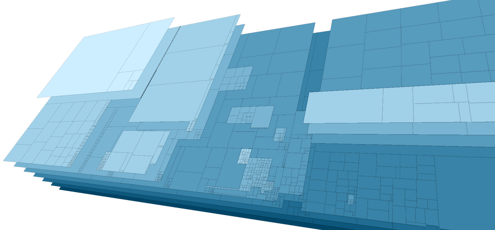

# Treemap.js

A treemap is a type of data diagram  which shows a (hierarchical) list of values as nested rectangles. This class is also part of the [Generative Design Library](https://github.com/generative-design/generative-design-library.js).

I decided to puplish it here as a seperate library to have it as a pure, independent, tiny and single-purpose class. It might be the right thing for you, if you want to generate and draw a treemap without having all the other great but distractive stuff in other libraries like D3.js.

## Reference

<!-- Generated by documentation.js. Update this documentation by updating the source code. -->

#### Table of Contents

-   [Treemap](#treemap)
    -   [x](#x)
    -   [y](#y)
    -   [w](#w)
    -   [h](#h)
    -   [minCount](#mincount)
    -   [maxCount](#maxcount)
    -   [level](#level)
    -   [depth](#depth)
    -   [itemCount](#itemcount)
    -   [index](#index)
-   [addData](#adddata)
-   [addTreemap](#addtreemap)
-   [calculate](#calculate)
-   [draw](#draw)

### Treemap

Creates a new empty Treemap with position (x, y), width and height. 
To specify drawing a bit more, you can give drawing options. 'sort' is true or false. If false, the elements will be shuffeled.
'direction' is either "horizontal", "vertical" or "both". With 'ignore', you can easily switch on and off branches of the Treemap. 
Content may be added using addData() or addTreemap().

**Parameters**

-   `x` **[Number](https://developer.mozilla.org/docs/Web/JavaScript/Reference/Global_Objects/Number)** x position
-   `y` **[Number](https://developer.mozilla.org/docs/Web/JavaScript/Reference/Global_Objects/Number)** y position
-   `w` **[Number](https://developer.mozilla.org/docs/Web/JavaScript/Reference/Global_Objects/Number)** width
-   `h` **[Number](https://developer.mozilla.org/docs/Web/JavaScript/Reference/Global_Objects/Number)** height
-   `options` **[Object](https://developer.mozilla.org/docs/Web/JavaScript/Reference/Global_Objects/Object)?** drawing and sorting options {sort:true or false, direction:"horizontal", "vertical" or "both", ignore:["abc", "xyz"]}

Returns **[Treemap](#treemap)** the new empty Treemap

#### x

x position of the rectangle.

#### y

y position of the rectangle.

#### w

width of the rectangle.

#### h

height of the rectangle.

#### minCount

the minimum count value of the items in the items array

#### maxCount

the maximum count value of the items in the items array

#### level

level of the item; the root node has level 0

#### depth

the depth of the branch; end nodes have depth 0

#### itemCount

the number of items in the complete branch

#### index

index of the item in the sorted items array.

### addData

Adds data to the Treemap. If you give just one parameter, this value will be added to the items array.
If there is already an item which has this value as data, just increase the counter of that item.
If not, create a new Treemap with that data and init the counter with 1.
If you have a complex object or array of nested subitems, you can give a second parameter, 
which defines what keys should be used to build the Treemap. This second parameter is in the form
{children:"items", count:"size", data:"name"}. 
The key 'children' defines, where to find the nested arrays. If you have a plain nested array, just leave this out. 
The key 'count' defines, which value to map to the size of the rectangles of the Treemap.
The key 'data' defines, which data to store. If omitted, the complete object or array branch is stored. 
This might be the way to choose in most cases. That way you keep all the information accessible when drawing the treemap.

**Parameters**

-   `data` **([String](https://developer.mozilla.org/docs/Web/JavaScript/Reference/Global_Objects/String) \| [Number](https://developer.mozilla.org/docs/Web/JavaScript/Reference/Global_Objects/Number) \| [Object](https://developer.mozilla.org/docs/Web/JavaScript/Reference/Global_Objects/Object) \| [Array](https://developer.mozilla.org/docs/Web/JavaScript/Reference/Global_Objects/Array))** the data element (e.g. a String)
-   `keys` **[Object](https://developer.mozilla.org/docs/Web/JavaScript/Reference/Global_Objects/Object)?** which keys should be used to build the Treemap: e.g. {children:"items", count:"size", data:"name"}. See the example for different ways how to use that.

Returns **[Boolean](https://developer.mozilla.org/docs/Web/JavaScript/Reference/Global_Objects/Boolean)** returns true, if a new treemap was created

### addTreemap

Adds an empty treemap to this treemap. If data is given, this could be used 
to show and hide a complete sub-treemap from the diagram. There is no check,
if there is already another treemap with that data.

**Parameters**

-   `data` **([String](https://developer.mozilla.org/docs/Web/JavaScript/Reference/Global_Objects/String) \| [Number](https://developer.mozilla.org/docs/Web/JavaScript/Reference/Global_Objects/Number) \| [Object](https://developer.mozilla.org/docs/Web/JavaScript/Reference/Global_Objects/Object) \| [Array](https://developer.mozilla.org/docs/Web/JavaScript/Reference/Global_Objects/Array))** the data element (e.g. a String)
-   `count` **[Number](https://developer.mozilla.org/docs/Web/JavaScript/Reference/Global_Objects/Number)?** the initial counter

Returns **[Treemap](#treemap)** returns the new Treemap

### calculate

Calculates the rectangles of each item. While doing this, all counters 
and ignore flags are updated.

### draw

A simple recursive drawing routine. You have to supply a function for drawing one item. This function gets the actual item 
as a parameter and has access to all the fields of that item, most important `x`, `y`, `w`, and `h`.
`level` and `depth` tells you, how deep this item is nested in the tree. The root node has level 0, an end node has depth 0. `itemCount` gives you the number of items inside this item, counted recursively and the `index` of item inside the parents sorted items array.
Example:         

    myTreemap.draw(function(item) { 
      var r = Math.min(item.w/4, item.h/4, 5);
      rect(item.x, item.y, item.w, item.h, r); 
    }); 

**Parameters**

-   `drawItemFunction` **[Function](https://developer.mozilla.org/docs/Web/JavaScript/Reference/Statements/function)** a function that draws one item
